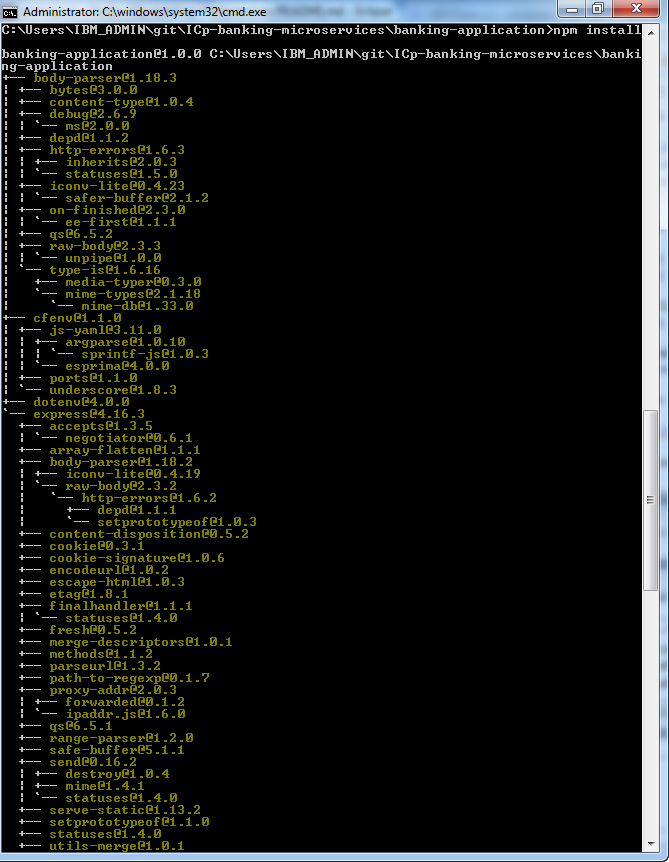

# Deploy a financial microservice using Red Hat OpenShift Container Platform (OCP) on Linux on Z 

In this lab, you will experience how a traditional z/OS transaction can be modernized to create services (APIs) that can be assessed by a hybrid cloud application deployed in Red Hat OCP cluster residing on Linux on Z. 

You will perform the following tasks:

* Using the IBM API Portal to connect to a set of z/OS banking APIs created for this lab. 
* Modify an existing web application to acess the z/OS banking APIs. Using node.js to build and test the web application. 
* Build, deploy, and test the web application on OCP.
* Using OCP to modify the web application and redeploy the changes.

# Architecture

This lab accesses a fictitious retail banking system called MPLbank. MPLbank integrates an Account Management System running on IBM Mainframe. On top of this component, an API layer based on z/OS Connect Enterprise Edition and IBM API Connect has been set up to deliver banking APIs. It makes banking services reachable through APIs from all kind of applications. 

1. The user deploys a Docker image (banking application based microservice) to the OCP.  
2. The user configures and runs a container based on this Docker image. Once started, the application calls banking APIs published in API Connect.
3. API Connect calls the back-end Z Mainframe through a banking API published in z/OS Connect EE.
4. z/OS Connect EE calls the Account Management System (AMS) running in CICS. A COBOL program processes the request and returns banking data. Finally, banking data are sent back to the microservice application.

# Included components

* [Red Hat OpenShift Container Platform](https://www.openshift.com)
* [IBM API Connect](http://www-03.ibm.com/software/products/en/api-connect)
* [IBM z/OS Connect Enterprise Edition](https://www.ibm.com/us-en/marketplace/connect-enterprise-edition)
* [IBM CICS Tansaction Server](https://www.ibm.com/us-en/marketplace/cics-transaction-server#product-header-top)
* [IBM Db2](https://ed www.ibm.com/analytics/db2/zos)

# Featured technologies

* [Docker](https://www.Docker.com/)
* [Microservices](https://www.ibm.com/cloud/garage/architectures/microservices/)
* [IBM LinuxONE](https://www.ibm.com/it-infrastructure/LinuxONE)
* [IBM Z Mainframe](https://www.ibm.com/it-infrastructure/z)

# Steps

### Step 1 - Discover and locally run the banking application

- [Part 1 - Discover the banking application]
- [Part 2 - Subscribe to the banking API through the API Developer Portal]
- [Part 3 - Run the banking application with Node.js]
- [Part 4 - Push the banking application to your GitHub repository]

### Step 2 - Deploy the banking microservice from OCP

- [Part 1 - Using the OCP tool to deploy the banking application using a dockerfile].
- [Part 2 - Access your banking microservice].
- [Part 3 - Modify the your banking microservice and redeploy].
---

# Step 1 - Discover and locally run the banking application

## Part 1 - Discover the banking application

1. Launch a terminal and clone your GitHub repository *banking-app-xx* to create a local copy of your banking application, where xx is your assigned ID number:

   `git clone https://github.com/zcloud-01/banking-app-xx`
    
2. Take a look at the imported *banking-app-xx* folder:

   `cd zcloud-01-banking-app-xx`
   
   `dir or ls`
   
	* *app.js*: the application server code.
	* *public/index.html*: the application client code (banking dashboard).
	* *public/css*: the application stylesheet.
	* *public/js*: the JavaScript libraries. 
	* *public/js/bankingAPI.js* will be modified later to connect to a corebanking system through API calls.
	* *package.json*: the package dependencies file.
	* *Dockerfile*: file to build the Docker image. 

## Part 2 - Subscribe to the banking API through the API Developer Portal

1. Go to the [API Developer Portal].

2. Login to your account.

3. Create a new application.
	* Click **Apps** from the menu.
	* Click **Create new App**.
	* Fill in all the required fields.
	* For Title: use zcloudxx (e.g zcloud01). 
	* Click **Submit**.
	
	Make a note of the *client ID* and *client Secret*. You will need them to access the API later.
	

4. Before working with the banking API, you need to subscribe to it first. Display the list of available API products.
	
	* Click **API Products** from the top menu.
	* Click **Banking Product** in the list.

5. Subscribe to the Banking API.
	
	* Click **Subscribe** to the Default Plan.
	
	
	* Select the App that you have just created before.
	* Click **Subscribe**.
	
6. Modify the *banking-application/public/js/bankingAPI.js* in your banking application.
	
	* Replace *YOUR_CLIENT_ID_HERE* by your client ID value from the IBM API developer portal.
	* Replace *YOUR_CLIENT_SECRET_HERE* by your client Secret value from the IBM API developer portal.

## Part 3 - Run the banking application with Node.js

1. Go to your banking application folder:

    `cd zcloud-01/banking-app-xx/banking-application`

2. Install Node.Js package dependencies of the banking application using : `npm install`
	
	* As a result, dependencies are installed in your project folder.

3. Run the banking application using : `node app.js` :
	
	* As a result, The banking application is started.
	
4. View your application, Launch a web browser and go to **localhost:3000**. The banking application appears.
    
	

5. Test your application.

	
    * Select a customer ID.
    * Please wait while the application calls banking data from the Mainframe through API Connect and z/OS Connect EE.
    * The result is displayed in a JSON structure.
    
6. The banking application locally works. Stop the Node.js server with a **SIGINT (CTRL+C)** from the terminal.

## Part 4 - Push the banking application to your GitHub repository

1. Add the *bankingAPI.js* file you just modified to the current content index:

   `git add public/js/bankingAPI.js`

2. Commit the fresh code you modified to add changes to the local repository:

   `git commit -m "Update of bankingAPI.js"`

3. Push the code you commited to transfer the last commit to your GitHub repository *ICp-banking-microservices*:

   `git push`

4. Go back to your online Github repository *banking-app-xx* using the web browser. 

	
	* Check that your code has been updated with commit label *Update of BankingAPI.js*

---

:thumbsup: Congratulations! Your banking application locally works and modifications have been pushed to your GitHub repository! Ready for Red Hat OpenShift Container Platform?

---

# Step 2 - Build and deploy a Docker image to OCP

The objective is to build a Docker image for the banking application from your github repository and then deploy it to OCP. 

1. Login to the OCP portal, https:console-openshift-console.apps.ocp.linuxone.io, with your assigned credentials. 

2. At the login screen, select ldapidp, enter your assigned username and password.

3. Create a project, name it project-xx, where xx is your assigned ID number.

4. Click +Add to crate a workload.

5. Selct From Dockerfile.

6. Enter the URL for your github repo.

7. Change the Container Port to 3000.

8. Click Create.

## Part 1 - Build the Docker image 

Docker can build images automatically by reading the instructions from a Dockerfile. A Dockerfile is a text document that contains all the commands a user could call on the command line to assemble an image. Using Docker build, users can create an automated build that executes several command-line instructions, step by step.

1. Create your LinuxONE virtual server to build the Docker image from the LinuxONE Community Cloud following the [virtual Server Deployment Guide](https://github.com/LinuxONE-community-cloud/technical-resources/blob/master/deploy-virtual-server.md): 

	1. You will request access to LinuxONE Community Cloud.
	2. You will make a first time setup (select SLES12SP3).
	3. You will deploy your LinuxONE virtual server.
	4. You will log in to your LinuxONE virtual server using SSH.
	
	As a result, you have your LinuxONE virtual server (SLES12SP3) created (**YOUR_LINUX_IP** is your LinuxONE virtual server IP Adress)
	
	
	
2. Once logged in with SSH, clone your fresh source code from your *YOUR_USERNAME/ICp-banking-microservices* Github repository into your LinuxONE virtual server:

	`git clone https://github.com/YOUR_USERNAME/ICp-banking-microservices`

3. Take a look at the *ICp-banking-microservices/banking-application/Dockerfile* file:

	`cat ICp-banking-microservices/banking-application/Dockerfile`

	
	* *FROM ibmcom/ibmnode*: This command gathers, from IBM's public Docker repository, a Ubuntu Linux image containing all the basic components to run a Node.js application. It will be used as a basis for our usecase. 
	* *WORKDIR "/app"*: This command creates a directory inside our image, from which we will inject our specific files.
	* *COPY package.json /app/*: This command copies our **package.json** file into the working directory inside our image. This file holds information about the app, most importantly the package dependencies it will need.
	* *RUN cd /app; npm install; npm prune --production*: These commands first move our focus to the working directory, then download and install our app's required dependencies.
	* *COPY . /app*: This command copies everything left of the app into our working directory inside the Docker image, i.e. our app's source code.
	* *ENV NODE_ENV production* and *ENV PORT 3000*: These two commands set environment variables. The first one tells our Node.js instance that we run in production mode, and thus don't need development libraries. The other one sets the port 3000 as our main networking port.
	* *EXPOSE 3000*: This command tells Docker to map the image's port 3000 to the operating system's port 3000. It will gives us a network access to the Docker image and thus the Node.js app.
	* *CMD ["npm", "start"]*: This last command tells Docker what to do when we launch the image, in our case **npm start**, which will start the Node.js app.
	
4. Build your Docker image:

	1. First, change directory to the proper location for our image.
	`cd ICp-banking-microservices/banking-application`
	2. Execute the Docker command to create your image.
	`sudo docker build -t "YOUR_USERNAME-banking-image:latest" .`
	
5. As a result, a Docker image is created based on your Dockerfile and your source code pulled from Github :

	`sudo docker images`
	
6. Manually start a new container based on your fresh Docker image:

	`sudo docker run -p 3000:3000 YOUR_USERNAME-banking-image`
	
	
4. Launch a web browser and go to **YOUR_LINUX_IP:3000**. The banking application appears.
    
	

5. Test your application.

	
    * Select a customer ID.
    * Please wait while the application calls banking data from the Mainframe through API Connect and z/OS Connect EE.
    * The result is displayed in a JSON structure.

## Part 2 - Deploy the Docker image to IBM Cloud Private

In this Code Pattern, an automatic process (Jenkins build) has been set up for you to deploy the Docker image to ICP. 

The Jenkins build processed as follows:

1. Jenkins pulled the source code from a GitHub repository *YOUR_USERNAME/ICp-banking-microservices* like yours.
2. Jenkins built the Docker image from the Docker file described before. It has been called **cluster68.icp:8500/codepatterns/code-pattern-icp-banking-microservices** and tagged *latest*.
3. Jenkins connected to ICP and then deployed the Docker image to its Docker image repository.
	
> NOTE: If you are practicing this pattern during an event like SHARE or Think, you are authorized to practice this deployment. Otherwise, go to Part 3 below.
>
> 4. Copy and Paste this URL into your browser address bar : `http://URL_CICD_SERVER/deploy/GITHUB_USERNAME` 
>	
>	* Ask the IBMer managing the lab session for the correct URL_CICD_SERVER.
>	* Replace *GITHUB_USERNAME* with your username.
>
> 5. Click **Enter**. The deployment is processing: 
> 	* The process pulls your source code from your GitHub repository *YOUR_USERNAME/ICp-banking-microservices*.
> 	* The process builds the Docker image from the Docker file described before. It has been called **YOUR_USERNAME-icp-banking-microservices** and tagged *latest*. It will be referred to as **YOUR_IMAGE_NAME**. 
> 	* The process connects to ICP and then deploys the Docker image to its Docker image repository.
> 	
> 6. Wait for the successful completion message of your build: **Deployment successful**
> 

As a result, the banking application is now ready to be instantiated from the ICP catalog.

---

:thumbsup: Congratulations! Your banking application has been packaged into a Docker image using a DevSecOps approach! Ready to use it from IBM Cloud Private?

---

# Step 2 - Instantiate the banking microservice from the IBM Cloud Private catalog

The objective is to discover the IBM Cloud Private catalog in order to instantiate a container from your Docker image containing your banking application. In this way, you will be able to test your banking application from ICp.

## Part 1 - Discover the Helm chart from the calalog

1. Subscribe to [IBM Cloud Private in the LinuxONE Community Cloud](https://developer.ibm.com/linuxone)

    * Click **Try Cloud Native Platform on the LinuxONE Community Cloud**.
    * Fill the form and submit.
    * Activate your account when you will receive the confirmation email.

2. Login to the IBM Cloud Private catalog (the access link is provided in the confirmation email). Fill credentials with yours:
	
	
    * Replace the username by your email.
    * Replace the password by your password.

3. Click the top-right icon from the menu to access the catalog.

	
	* Click on **Catalog**.

4. Click on the Helm Chart called **openmplbank - Banking dashboard** to see the overview of this banking microservice.

	> NOTE: If you are practicing this pattern during an IBM event like SHARE or Think, Click on the Helm Chart called **openmplbank-ibm-lab4share**

	

## Part 2 - Configure and install your banking microservice

1. Check the chart derails and click on configure to create your container.

	
	* Click **Configure**.

2. Configure the container:

	
	* Fill the release name with *YOUR_USERNAME* (limit of 30 characters).
	* Select an available target namespace in the list.
	* The image repository is already filled with the Docker image defined before: **cluster68.icp:8500/codepatterns/code-pattern-icp-banking-microservices**.
	
	> NOTE: If you are practicing this pattern during an event like SHARE or Think, fill the image repository with your **YOUR_IMAGE_NAME**.

3. Click the **Install** button. When the process is finished, click **View Helm Release**.

	
	

## Part 3 - Access your banking microservice
1. From the Helm release view, the container details are displayed.

	
	* Click on **Launch** to display the banking microservice.

2. Test your application:
	
	
    * Select a customer ID.
    * Please wait while the application calls banking data from the Mainframe through API Connect and z/OS Connect EE.
    * The result is displayed in a JSON structure.
    
3. Your account is available for 24 hours. All your containers will removed when your account will expire.

---

:thumbsup: Congratulations! Your banking application has been instantiated from IBM Cloud Private as container. Your banking application succeeded to call banking APIs to call the Mainframe for banking business services.

---

# Licence

This code pattern is licensed under the Apache Software License, Version 2.  Separate third party code objects invoked within this code pattern are licensed by their respective providers pursuant to their own separate licenses. Contributions are subject to the [Developer Certificate of Origin, Version 1.1 (DCO)](https://developercertificate.org/) and the [Apache Software License, Version 2](http://www.apache.org/licenses/LICENSE-2.0.txt).

[Apache Software License (ASL) FAQ](http://www.apache.org/foundation/license-faq.html#WhatDoesItMEAN)

# Links

* [IBM Cloud Private](https://www.ibm.com/cloud/private)
* [IBM Cloud Private - Knowledge Center](https://www.ibm.com/support/knowledgecenter/en/SSBS6K/product_welcome_cloud_private.html)

[IBM ID]: https://www.ibm.com/account/us-en/signup/register.html
[API Developer Portal]: https://developer-contest-spbodieusibmcom-prod.developer.us.apiconnect.ibmcloud.com/
